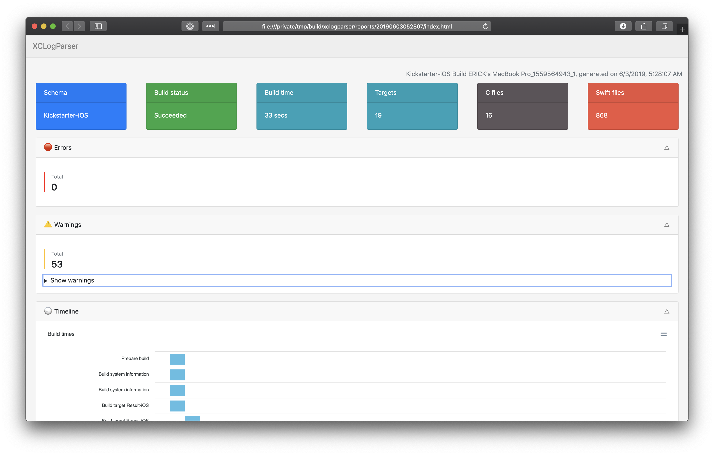
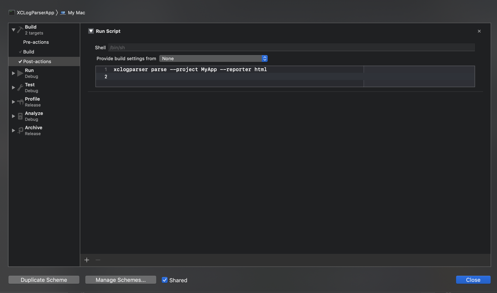
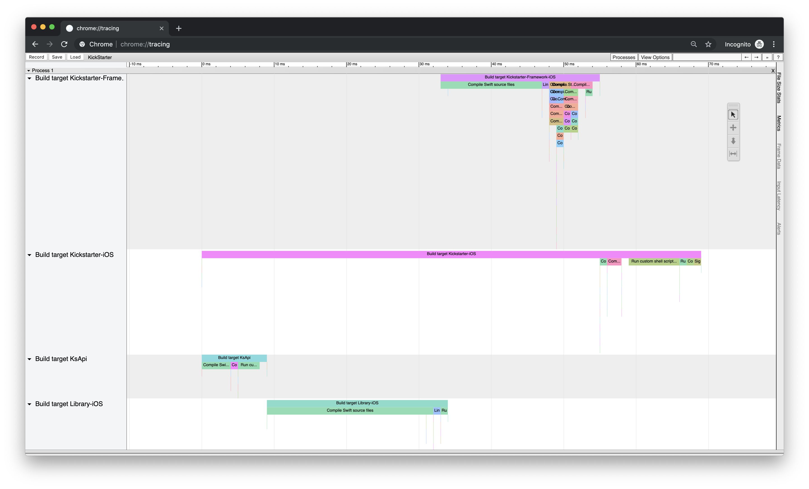

# XCLogParser

[](https://github.com/MobileNativeFoundation/XCLogParser/workflows/CI/badge.svg)
[](LICENSE)


XCLogParser is a CLI tool that parses the `SLF` serialization format used by Xcode and `xcodebuild` to store its Build and Test logs (`xcactivitylog` files).

You can find more information about the format used in the logs [here](/docs/Xcactivitylog%20Format.md). You can also check Erick Camacho's [talk at AltConf 2019](https://www.youtube.com/watch?v=QVwOzfJIDCc) about it.

The tool supports creating reports of different kinds to analyze the content of the logs. XCLogParser can give a lot of insights in regards to **build times** for every module and file in your project, **warnings**, **errors** and **unit tests** results.

This is an example of a report created from the Build Log of the [Kickstarter iOS open source app](https://github.com/kickstarter/ios-oss).



## How and Why

`XCLogParser` is written as a [SPM](https://github.com/apple/swift-package-manager/) executable and it supports three commands:

1. [Dump](#dump-command) the contents of an `xcactivitylog` into a `JSON` document.
2. [Parse](#parse-command) the contents of an `xcactivitylog` into different kind of reports (`json`, `flatJson`, `summaryJson`, `chromeTracer`, `issues` and `html`).
3. Dump the [Manifest](#manifest-command) contents of a `LogStoreManifest.plist` file into a `JSON` document.

Depending on your needs, there are various use-cases where `XCLogParser` can help you:
- Understanding and detailed tracking of build times.
- Automatically retrieve unit test results, warnings and errors.
- Build other developer tools for usage outside Xcode.
- Automatically and continuously data delivery for historic analysis.

## Installation

You can compile the executable with the command `rake build[debug]` or `rake build[release]` or simply use the Swift Package Manager commands directly. You can also run `rake install` to install the executable in your `/usr/local/bin` directory.

### Homebrew

`$ brew install xclogparser`

We are currently working on adding more installation options.

## Xcode Integration

You can automate the parsing of `xcactivitylog` files with a post-scheme build action. In this way, the last build log can be parsed as soon as a build finishes. To do that, open the scheme editor in a project and expand the "Build" panel on the left side. You can then add a new "Post-action" run script and invoke the `xclogparser` executable with the required parameters:

```bash
xclogparser parse --project MyApp --reporter html
```



This script assumes that the `xclogparser` executable is installed and present in your PATH.

The run script is executed in a temporary directory by Xcode, so you may find it useful to immediately open the generated output with `open MyAppLogs` at the end of the script.
The Finder will automatically open the output folder after a build completes and you can then view the generated HTML page that contains a nice visualization of your build! ✨

### Tips & Tricks

1. Errors thrown in post-action run scripts are silenced, so it could be hard to notice simple mistakes.
1. Since Xcode 11, `xcodebuild` only generates the .xcactivitylog build logs when the option `-resultBundlePath`. If you're compiling with that command and not with Xcode, be sure to set that option to a valid path.
1. Xcode likes to wait for all subprocesses to exit before completing the build. For this reason, you may notice a delayed "Build Succeeded" message if your post-scheme action is taking too long to execute. You can workaround this by offloading the execution to another script in the background and immediately close the input, output and error streams in order to let Xcode and xcodebuild finish cleanly. Create the following `launcher` script and invoke it from your post-scheme action as follows `launcher command-that-parses-the-log-here`:
    ```sh
    #!/bin/sh

    # The first argument is the directory of the executable you want to run.
    # The following arguments are directly forwarded to the executable.
    # We execute the command in the background and immediately close the input, output
    # and error streams in order to let Xcode and xcodebuild finish cleanly.
    # This is done to prevent Xcode and xcodebuild being stuck in waiting for all
    # subprocesses to end before exiting.
    executable=$1
    shift;
    $executable "$@" <&- >&- 2>&- &
    ```
1. The post-scheme action is not executed in case the build fails. An undocumented feature in Xcode allows you to execute it even in this case. Set the attribute `runPostActionsOnFailure` to `YES` in your scheme's `BuildAction` as follows:
    ```xml
    <BuildAction buildImplicitDependencies='YES' parallelizeBuildables='YES' runPostActionsOnFailure='YES'>
    ```

## Log Types

### Build Logs

The `xcactivitylog` files are created by Xcode/`xcodebuild` a few seconds after a build completes. The log is placed in the `DerivedData/YourProjectName-UUID/Logs/Build` directory. It is a binary file in the `SLF` format compressed with gzip.

In the same directory, you will find a `LogStoreManifest.plist` file with the list of `xcactivitylog` files generated for the project. This file can be monitored in order to get notified every time a new log is ready.

### Test Logs

The test logs are created inside the `DerivedData/YourProjectName-UUID/Logs/Test` directory. Xcode and `xcodebuild` create different logs. You can find a good description about which ones are created in this [blog post](https://michele.io/test-logs-in-xcode/).

## Features

### Dump Command

Dumps the whole content of an `xcactivitylog` file as `JSON` document. You can use this command if you want to have a raw but easy to parse representation of a log.

Examples:

```bash
xclogparser dump --file path/to/log.xcactivitylog --output activity.json
xclogparser dump --project MyProject --output activity.json --redacted
```

An example output has been omitted for brevity since it can contain a lot of information regarding a build.

<details>
  <summary>Available parameters</summary>

  | Parameter Name | Description | Required |
  |-----|---|-----|
  | `--file`  | The path to the `xcactivitylog`.  | No * |
  | `--project`  | The name of the project if you don't know the path to the log. The tool will try to find the latest Build log in a folder that starts with that name inside the `DerivedData` directory.  Use `--strictProjectName` for stricter name matching.  | No * |
  | `--workspace`  | The path to the `xcworkspace` file if you don't know the path to the log. It will generate the folder name for the project in the `DerivedData` folder using Xcode's hash algorithm and it will try to locate the latest Build Log inside that directory.  | No * |
  | `--xcodeproj`  | The path to the `xcodeproj` file if you don't know the path to the log and if the project doesn't have a `xcworkspace` file. It will generate the folder name for the project in the `DerivedData` folder using Xcode's hash algorithm and it will try to locate the latest Build Log inside that directory.  | No * |
  | `--derived_data`  | The path to the derived data folder if you are using `xcodebuild` to build your project with the `-derivedDataPath` option.  | No |
  | `--output`  | If specified, the JSON file will be written to the given path. If not defined, the command will output to the standard output.  | No |
  | `--redacted`  | If specified, the username will be replaced by the word `redacted` in the file paths contained in the logs. Useful for privacy reasons but slightly decreases the performance.  | No |
  | `--without_build_specific_info`  | If specified, build specific information will be removed from the logs (for example `bolnckhlbzxpxoeyfujluasoupft` will be removed from  `DerivedData/Product-bolnckhlbzxpxoeyfujluasoupft/Build` ). Useful for grouping logs by its content.  | No |
  | `--strictProjectName`  | Used in conjunction with `--project`. If specified, a stricter name matching will be done for the project name.  | No |

  >No *: One of `--file`, `--project`, `--workspace`, `--xcodeproj` parameters is required.

</details>

### Parse Command

Parses the build information from a `xcactivitylog` and converts it into different representations such as a [JSON file](#JSON-Reporter), [flat JSON file](#FlatJson-Reporter), [summary JSON file](#SummaryJson-Reporter), [issues JSON file](#Issues-Reporter), [Chrome Tracer file](#ChromeTracer-Reporter) or a static [HTML page](#HTML-Reporter).

This command supports parsing additional data if some flags are passed to Xcode/xcodebuild: 

1. `swiftc` reported compilation times. For using that feature, you need to build your project with the options `-Xfrontend -debug-time-expression-type-checking` and `-Xfrontend -debug-time-function-bodies`.
2. ld64's statistics output. The statistics info can be generated by adding `-Xlinker -print_statistics` to Xcode's "Other Linker Flags" and it's useful for tracking linking time regression.
3. Clang's time trace data. When the `-ftime-trace` flag is specified, clang will generate a `json` tracing file for each translation unit and XCLogParser will collect them and add its data to the parser output.

Examples:

```bash
xclogparser parse --project MyApp --reporter json --output build.json
xclogparser parse --file /path/to/log.xcactivitylog --reporter chromeTracer
xclogparser parse --workspace /path/to/MyApp.xcworkspace --derived_data /path/to/custom/DerivedData --reporter html --redacted
```

Example output available in the [reporters](#reporters) section.

<details>
  <summary>Available parameters</summary>

  | Parameter Name | Description | Required |
  |-----|---|-----|
  | `--reporter`  | The reporter used to transform the logs. It can be either `json`, `flatJson`, `summaryJson`, `chromeTracer`, `issues` or `html`. (required)  | Yes |
  | `--file`  | The path to the `xcactivitylog`.  | No * |
  | `--project`  | The name of the project if you don't know the path to the log. The tool will try to find the latest Build log in a folder that starts with that name inside the `DerivedData` directory.  Use `--strictProjectName` for stricter name matching.  | No * |
  | `--workspace`  | The path to the `xcworkspace` file if you don't know the path to the log. It will generate the folder name for the project in the `DerivedData` folder using Xcode's hash algorithm and it will try to locate the latest Build Log inside that directory.  | No * |
  | `--xcodeproj`  | The path to the `xcodeproj` file if you don't know the path to the log and if the project doesn't have a `xcworkspace` file. It will generate the folder name for the project in the `DerivedData` folder using Xcode's hash algorithm and it will try to locate the latest Build Log inside that directory.  | No * |
  | `--derived_data`  | The path to the derived data folder if you are using `xcodebuild` to build your project with the `-derivedDataPath` option.  | No |
  | `--output`  | If specified, the JSON file will be written to the given path. If not defined, the command will output to the standard output.  | No |
  | `--rootOutput`  | If specified, the HTML file will be written to the given folder, it has precedence over `output` if the folder doesn't exist will be created. It works with relative home path.`~`  | No |
  | `--redacted`  | If specified, the username will be replaced by the word `redacted` in the file paths contained in the logs. Useful for privacy reasons but slightly decreases the performance.  | No |
  | `--without_build_specific_info`  | If specified, build specific information will be removed from the logs (for example `bolnckhlbzxpxoeyfujluasoupft` will be removed from  `DerivedData/Product-bolnckhlbzxpxoeyfujluasoupft/Build` ). Useful for grouping logs by its content.  | No |
  | `--strictProjectName`  | Used in conjunction with `--project`. If specified, a stricter name matching will be done for the project name.  | No |
  | `--machine_name`  | If specified, the machine name will be used to create the `buildIdentifier`. If it is not specified, the host name will be used.  | No |
  | `--omit_warnings` | Omit the warnings details in the final report. This is useful if there are too many of them and the report's size is too big with them. | No |
  | `--omit_notes` | Omit the notes details in the final report. This is useful if there are too many of them and the report's size is too big with them. | No |

  >No *: One of `--file`, `--project`, `--workspace`, `--xcodeproj` parameters is required.

</details>

### Manifest Command

Outputs the contents of `LogStoreManifest.plist` which lists all the `xcactivitylog` files generated for the project as JSON.

Example:

```bash
xclogparser manifest --project MyApp
```

Example output:
```json
{
  "scheme" : "MyApp",
  "timestampEnd" : 1548337458,
  "fileName" : "D6539DED-8AC8-4508-9841-46606D0C794A.xcactivitylog",
  "title" : "Build MyApp",
  "duration" : 46,
  "timestampStart" : 1548337412,
  "uniqueIdentifier" : "D6539DED-8AC8-4508-9841-46606D0C794A",
  "type" : "xcode"
}
```

<details>
  <summary>Available parameters</summary>

  | Parameter Name | Description | Required |
  |-----|---|-----|
  | `--log_manifest`  | The path to an existing `LogStoreManifest.plist`.  | No * |
  | `--project`  | The name of the project if you don't know the path to the log. The tool will try to find the latest Build log in a folder that starts with that name inside the `DerivedData` directory.  Use `--strictProjectName` for stricter name matching.  | No * |
  | `--workspace`  | The path to the `xcworkspace` file if you don't know the path to the log. It will generate the folder name for the project in the `DerivedData` folder using Xcode's hash algorithm and it will try to locate the latest Build Log inside that directory.  | No * |
  | `--xcodeproj`  | The path to the `xcodeproj` file if you don't know the path to the log and if the project doesn't have a `xcworkspace` file. It will generate the folder name for the project in the `DerivedData` folder using Xcode's hash algorithm and it will try to locate the latest Build Log inside that directory.  | No * |
  | `--derived_data`  | The path to the derived data folder if you are using `xcodebuild` to build your project with the `-derivedDataPath` option.  | No |
  | `--output`  | If specified, the JSON file will be written to the given path. If not defined, the command will output to the standard output.  | No |
  | `--strictProjectName`  | Used in conjunction with `--project`. If specified, a stricter name matching will be done for the project name.  | No |

  >No *: One of `--log-manifest`, `--project`, `--workspace`, `--xcodeproj` parameters is required.

</details>

## Reporters

The [parse command](#parse-command) has different types of reporters built-in that can represent and visualize the data of the logs:

- [JSON](#json-reporter)
- [Flat JSON](#flatjson-reporter)
- [Summary JSON](#summaryjson-reporter)
- [Chrome Tracer](#chrometracer-reporter)
- [Issues](#issues-reporter)
- [HTML](#html-reporter)

### JSON Reporter

This reporter parses the log and outputs it as JSON. It contains information about the duration of each step in the build, along other metadata and interesting information such as errors and warnings.

Example:

```bash
xclogparser parse --project MyApp --reporter json
```

<details>
  <summary>Example Output</summary>

  ```json
  {
      "detailStepType" : "swiftCompilation",
      "startTimestamp" : 1545143336.649699,
      "endTimestamp" : 1545143336.649699,
      "schema" : "MyApp",
      "domain" : "com.apple.dt.IDE.BuildLogSection",
      "parentIdentifier" : "095709ba230e4eda80ab43be3b68f99c_1545299644.4805899_20",
      "endDate" : "2018-12-18T14:28:56.650000+0000",
      "title" : "Compile \/Users\/<redacted>\/projects\/MyApp\/Libraries\/Utilities\/Sources\/Disposables\/Cancelable.swift",
      "identifier" : "095709ba230e4eda80ab43be3b68f99c_1545299644.4805899_185",
      "signature" : "CompileSwift normal x86_64 \/Users\/<redacted>\/MyApp\/Libraries\/Utilities\/Sources\/Disposables\/Cancelable.swift",
      "type" : "detail",
      "buildStatus" : "succeeded",
      "subSteps" : [

      ],
      "startDate" : "2018-12-18T14:28:56.650000+0000",
      "buildIdentifier" : "095709ba230e4eda80ab43be3b68f99c_1545299644.4805899",
      "machineName" : "095709ba230e4eda80ab43be3b68f99c",
      "duration" : 5.5941859483718872,
      "errors" : "",
      "warnings" : "",
      "errorCount" : 0,
      "warningCount" : 0,
      "errors" : [],
      "warnings" : [],
      "swiftFunctionTimes" : [
        {
          "durationMS" : 0.08,
          "occurrences" : 5,
          "startingColumn" : 36,
          "startingLine" : 48,
          "file" : "file:\/\/\/Users\/<redacted>\/MyApp\/Libraries\/Utilities\/Sources\/Disposables\/Cancelable.swift",
          "signature" : "getter description"
        }
      ],
      "swiftTypeCheckTimes" : [
        {
          "durationMS" : 0.5,
          "occurrences" : 2,
          "startingColumn" : 16,
          "startingLine" : 9,
          "file" : "file:\/\/\/Users\/<redacted>\/MyApp\/Libraries\/Utilities\/Sources\/Disposables\/Cancelable.swift",
        }
      ]
  }
  ```
</details>


For more information regarding each field, check out the [JSON format documentation](https://github.com/MobileNativeFoundation/XCLogParser/blob/master/docs/JSON%20Format.md).


### FlatJson Reporter

Parses the log as an array of JSON objects, with no nested steps (the field `subSteps` is always empty). Useful to dump the data into a database so it's easier to analyze.

The format of the JSON objects in the array is the same to the one used in the `json` reporter.

Example:

```bash
xclogparser parse --file path/to/log.xcactivitylog --reporter flatJson
```

<details>
  <summary>Example Output</summary>

  ```json
  [
    {
      "parentIdentifier" : "",
      "title" : "Build MobiusCore",
      "warningCount" : 0,
      "duration" : 0,
      "startTimestamp" : 1558590748,
      "signature" : "Build MobiusCore",
      "endDate" : "2019-05-23T05:52:28.274000Z",
      "errorCount" : 0,
      "domain" : "Xcode.IDEActivityLogDomainType.BuildLog",
      "type" : "main",
      "identifier" : "68a2bbd0048a454d91b3734b5d5dc45e_1558640253_1",
      "buildStatus" : "succeeded",
      "schema" : "MobiusCore",
      "subSteps" : [

      ],
      "endTimestamp" : 1558590748,
      "architecture" : "",
      "machineName" : "68a2bbd0048a454d91b3734b5d5dc45e",
      "buildIdentifier" : "68a2bbd0048a454d91b3734b5d5dc45e_1558640253",
      "startDate" : "2019-05-23T05:52:28.244000Z",
      "documentURL" : "",
      "detailStepType" : "none"
    },
    {
      "parentIdentifier" : "68a2bbd0048a454d91b3734b5d5dc45e_1558640253_1",
      "title" : "Prepare build",
      "warningCount" : 0,
      "duration" : 0,
      "startTimestamp" : 1558590748,
      "signature" : "Prepare build",
      "endDate" : "2019-05-23T05:52:28.261000Z",
      "errorCount" : 0,
      "domain" : "Xcode.IDEActivityLogDomainType.XCBuild.Preparation",
      "type" : "target",
      "identifier" : "68a2bbd0048a454d91b3734b5d5dc45e_1558640253_2",
      "buildStatus" : "succeeded",
      "schema" : "MobiusCore",
      "subSteps" : [

      ],
      "endTimestamp" : 1558590748,
      "architecture" : "",
      "machineName" : "68a2bbd0048a454d91b3734b5d5dc45e",
      "buildIdentifier" : "68a2bbd0048a454d91b3734b5d5dc45e_1558640253",
      "startDate" : "2019-05-23T05:52:28.254000Z",
      "documentURL" : "",
      "detailStepType" : "none"
    },{
      "parentIdentifier" : "68a2bbd0048a454d91b3734b5d5dc45e_1558640253_1",
      "title" : "Build target MobiusCore",
      "warningCount" : 0,
      "duration" : 4,
      "startTimestamp" : 1558590708,
      "signature" : "MobiusCore-fmrwijcuutzbrmbgantlsfqxegcg",
      "endDate" : "2019-05-23T05:51:51.890000Z",
      "errorCount" : 0,
      "domain" : "Xcode.IDEActivityLogDomainType.target.product-type.framework",
      "type" : "target",
      "identifier" : "68a2bbd0048a454d91b3734b5d5dc45e_1558640253_3",
      "buildStatus" : "succeeded",
      "schema" : "MobiusCore",
      "subSteps" : [

      ],
      "endTimestamp" : 1558590712,
      "architecture" : "",
      "machineName" : "68a2bbd0048a454d91b3734b5d5dc45e",
      "buildIdentifier" : "68a2bbd0048a454d91b3734b5d5dc45e_1558640253",
      "startDate" : "2019-05-23T05:51:48.206000Z",
      "documentURL" : "",
      "detailStepType" : "none"
    },
    ...
  ]
  ```
</details>

For more information regarding each field, check out the [JSON format documentation](https://github.com/MobileNativeFoundation/XCLogParser/blob/master/docs/JSON%20Format.md).

### SummaryJson Reporter

Parses the log as a JSON object, with no nested steps (the field `subSteps` is always empty). Useful to get a high level summary of the build.

Example:

```bash
xclogparser parse --file path/to/log.xcactivitylog --reporter summaryJson
```

<details>
  <summary>Example Output</summary>

  ```json
    {
      "parentIdentifier" : "",
      "title" : "Build MobiusCore",
      "warningCount" : 0,
      "duration" : 0,
      "startTimestamp" : 1558590748,
      "signature" : "Build MobiusCore",
      "endDate" : "2019-05-23T05:52:28.274000Z",
      "errorCount" : 0,
      "domain" : "Xcode.IDEActivityLogDomainType.BuildLog",
      "type" : "main",
      "identifier" : "68a2bbd0048a454d91b3734b5d5dc45e_1558640253_1",
      "buildStatus" : "succeeded",
      "schema" : "MobiusCore",
      "subSteps" : [

      ],
      "endTimestamp" : 1558590748,
      "architecture" : "",
      "machineName" : "68a2bbd0048a454d91b3734b5d5dc45e",
      "buildIdentifier" : "68a2bbd0048a454d91b3734b5d5dc45e_1558640253",
      "startDate" : "2019-05-23T05:52:28.244000Z",
      "documentURL" : "",
      "detailStepType" : "none"
    }
  ```
</details>


For more information regarding each field, check out the [JSON format documentation](https://github.com/MobileNativeFoundation/XCLogParser/blob/master/docs/JSON%20Format.md).

### ChromeTracer Reporter

Parses the `xcactivitylog` as an array of JSON objects in the format used by the Chrome tracer. You can use this JSON to visualize the build times in the Chrome tracing tool inside Chrome: `chrome://tracing`.

Example:

```bash
xclogparser parse --file path/to/log.xcactivitylog --reporter chromeTracer
```

<details>
  <summary>Example Output</summary>

  
</details>

### Issues Reporter

Outputs the list of Errors and Warnings found in the log as a JSON document. Useful when you only want to check the issues found while building.

Example:

```bash
xclogparser parse --file path/to/log.xcactivitylog --reporter issues
```

<details>
    <summary>Example Output</summary>

    ```json
    {
      "errors" : [
        {
          "characterRangeStart" : 0,
          "startingColumnNumber" : 5,
          "endingColumnNumber" : 30,
          "characterRangeEnd" : 18446744073709551615,
          "title" : "use of undeclared type 'AType'",
          "endingLineNumber" : 10,
          "type" : "swiftError",
          "documentURL" : "file:\/\/\/MyProject\/MyFile.swift",
          "startingLineNumber" : 10,
          "severity" : 1
          "detail": "\/MyProject\/MyFile.swift:10:5: error: use of undeclared type 'AType'\r    func doSomething(completion: @escaping () -> AType) -> void) {\r^~~~\r"
        }
      ],
      "warnings" : [
        {
          "characterRangeStart" : 0,
          "startingColumnNumber" : 5,
          "endingColumnNumber" : 30,
          "characterRangeEnd" : 18446744073709551615,
          "title" : "Warning",
          "endingLineNumber" : 10,
          "type" : "swiftWarning",
          "documentURL" : "file:\/\/\/MyProject\/MyFile.swift",
          "startingLineNumber" : 10,
          "severity" : 1
        }
      ]
    }
    ```
</details>

### HTML Reporter

Generates an HTML report to visualize build times per module and file, along with warning and error messages.

Example:

```bash
xclogparser parse --file path/to/log.xcactivitylog --reporter html --output build/reports
```

<details>
  <summary>Example Output</summary>

  
</details>

## Requirements and Compatibility

| Environment | Version     |
| ----------- |-------------|
| 🛠 Xcode    | 11.0        |
| 🐦 Language | Swift 5.0   |

## Status

XCLogParser is currently in alpha status. We are using it internally and tested it on various projects, but we need the help from the community to test and improve it with more iOS and Mac applications.

## Development and Contributing

MacOS:

1. Clone the repo with `git clone git@github.com:MobileNativeFoundation/XCLogParser.git`.
2. Run `rake gen_resources` to generate a static resource Swift file that is needed to compile the app.
3. Run `swift package generate-xcodeproj` to generate a Xcode project (or use any text editor).
4. Run tests in Xcode directly (CMD + U) or using `rake test`.
5. Create issue and discuss a possible solution or improvement.
6. Create a PR.

Linux:

1. A Dockerfile is provided, you can create an image with the tag xlogparser: `docker build --tag xclogparser .`
2. To compile the app in Linux, just run the shell script: `./run-in-docker.sh`

If you find a bug or you would like to propose an improvement, you're welcome to create an [issue](https://github.com/MobileNativeFoundation/xclogparser/issues/new).

## Release

1. Make sure version set in [Version.swift](Sources/XCLogParser/commands/Version.swift) is updated
2. Create new release tag in GitHub with a tag format like `vx.x.x`. Provide release title and description.
3. Build release artifacts:
	1. for macOS, build an artifact using `DEVELOPER_DIR=<path_to_xcode_version> rake archive`. Use Xcode version matching with [Requirements](#requirements-and-compatibility) section.
	2. for Linux, run `./build_release_in_docker.sh`
4. Upload release artifacts to the release version summary:
	1. for macOS, upload zip file placed in `releases/XCLogParser-x.x.x.zip`
	2. for Linux, update current version in the filename and upload `releases/linux/XCLogParser-x.x.x-Linux.zip`

## Code of Conduct

This project adheres to the [Open Code of Conduct](https://github.com/spotify/code-of-conduct/blob/master/code-of-conduct.md). By participating, you are expected to honor this code.
